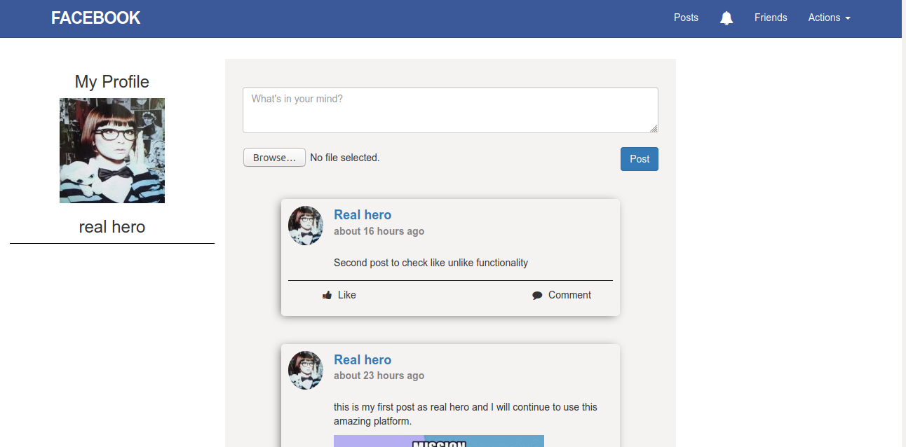

## Ruby On Rails: Micro-Facebook
This is a collaborative project from the microverse curriculum. This is a mini facebook project with minimal features like authentication with devise and omniauth-facebook, creating posts, like and comment posts, sending and accepting friend requests, and testing.

## Features of the App
    User [friendships, posts,comments, likes] modules and functionalities.
    The project was completed using Bootstrap, Devise, RSpec, Omniauth and PostgreSQL.

## [Screenshots]

  

## Live version of the App
  https://ancient-woodland-03904.herokuapp.com/signup

## Languages Used: 
### Ruby, HTML & CSS

## How to install

1. Open Terminal
2. git clone https://github.com/sumancrest0001/rails_mini_fb
3. cd rails_final_project
4. run rails db:migrate
5. run bundle install
6. run rails server

## Contributors
### sumancrest0001 
- [github](https://github.com/sumancrest0001)
- [linkedIn](https://www.linkedin.com/in/suman-shrestha0001/)

### noomdalv
- [github](https://github.com/noomdalv)

#### License

MIT Licensed
